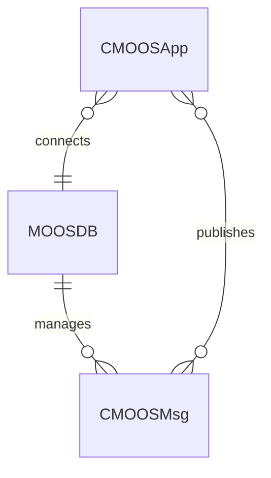
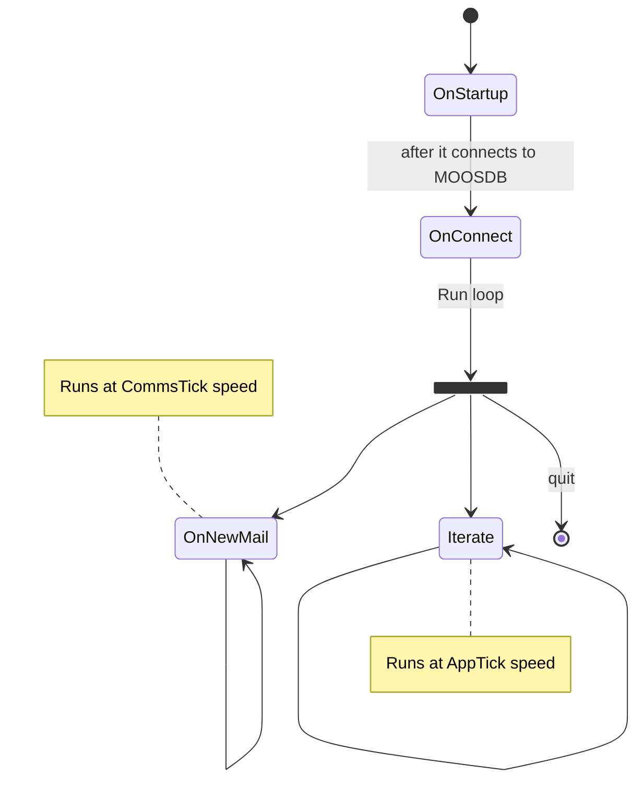
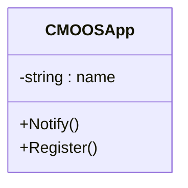

MOOS is [publish-subscribe](https://en.wikipedia.org/wiki/Publish%E2%80%93subscribe_pattern) [middleware](https://en.wikipedia.org/wiki/Message-oriented_middleware).

An MOOSApp ([[#CMOOSApp|`CMOOSApp`]]) communicates with the [[#MOOSDB]] and:

- publishes messages([[#CMOOSMsg|`CMOOSMsg`]]),
- registers for messages.

The MOOSDB will manages the incoming messages and send messages to all subscribed apps.
## MOOS Relationships

## MOOSDB
The MOOSDB is more a blackboard than a database. 
It keeps tracks of the message it receives.

Each message is unique by its name, see [[#CMOOSMsg Class|message class definition]].

## CMOOSApp
### `CMOOSApp` Lifecycle

### `CMOOSApp` Class
The following is a non-exhaustive class diagram of `CMOOSApp`:

## CMOOSMsg
### `CMOOSMsg` Class